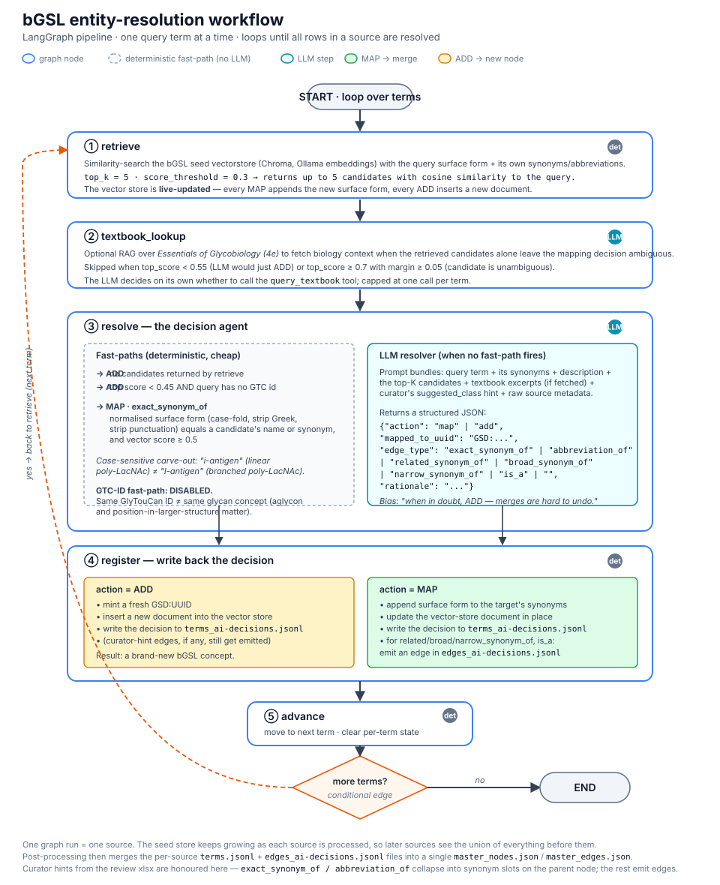

<a id="readme-top"></a>

<!--
*** This doc is created using the Best-README-Template: https://github.com/othneildrew/Best-README-Template/
-->

<!-- PROJECT SHIELDS -->
<!--
*** I'm using markdown "reference style" links for readability.
*** Reference links are enclosed in brackets [ ] instead of parentheses ( ).
*** See the bottom of this document for the declaration of the reference variables
*** for contributors-url, forks-url, etc. This is an optional, concise syntax you may use.
*** https://www.markdownguide.org/basic-syntax/#reference-style-links
-->

[![Release Notes][release-shield]][release-url]
[![Issues][issues-shield]][issues-url]

[![BiomarkerKB][biomarkerkb-shield]][biomarkerkb-url]
[![GlyGen][glygen-shield]][glygen-url]
[![Wiki Page][wiki-shield]][wiki-url]

<!-- PROJECT LOGO -->
<br />
<div align="center">
  <a href="https://github.com/glygener/glycan-structure-dictionary">
    
  </a>

<h1 align="center">Biomarker Glycan Structure Lexicon (bGSL)</h1>

  <p align="center">
    LLM-powered pipeline for extracting &amp; harmonizing glycan structure terminologies
    <br />
    <a href="docs/bgsl_workflow.md"><strong>Explore the docs »</strong></a>
    <br />
    <br />
    <a href="configs/prompts/glycan_classification_scheme.md">Glycan Term Classification</a>
    &middot;
    <a href="https://github.com/glygener/glycan-structure-dictionary/issues/new?labels=bug&template=bug-report---.md">Report Bug</a>
  </p>
</div>

<!-- TABLE OF CONTENTS -->
<div align="left">
  <div style="display: inline-block; text-align: left; border: 1px solid #888; border-radius: 30px; max-width: 340px;">
    <details style="padding: 10px 20px 0px;">
      <summary><strong>&nbsp&nbspTable of Contents</strong></summary>
      <ol>
        <li><a href="#about-this-project">About this project</a></li>
        <li><a href="#getting-started">Getting started</a></li>
        <li><a href="#usage">Usage</a></li>
        <li><a href="#data">Data</a></li>
        <li><a href="#license">License</a></li>
        <li><a href="#acknowledgements">Acknowledgements</a></li>
      </ol>
    </details>
  </div>
</div>

<!-- ABOUT THE PROJECT -->

## About This Project

The bGSL is a controlled vocabulary of glycan structure terms, harmonized across many public sources by an LLM-assisted entity-resolution pipeline. It captures the names people use for glycans and glycan-related structural features: full structures, motifs, epitopes, substructures, glycoform shorthand codes, composition formulae, and monosaccharide residues.

Glycan structures are named inconsistently across databases and literature. `Lewis x`, `LeX`, `Le^x`, `Lex`, and `lewis-x` all denote one epitope. bGSL runs a retrieval-augmented resolution workflow that folds these surface forms into a single de-duplicated node while preserving each source's provenance.

bGSL is a lexicon of glycan _terms_, not a database of glycan _structures_. Structural annotations (IUPAC condensed strings, GlyTouCan IDs, WURCS, GlycoCT) are carried through from the source datasets as provenance metadata and not neccessarily re-curated.

bGSL expands on the **Glycan Structure Dictionary (GSD)** (Vora et al., 2023); the original GSD (tagged-v0) is one of the source datasets it harmonizes.

> See **[docs/bgsl_workflow.md](docs/bgsl_workflow.md)** for full description of the pipeline and some examples.

**Previous Work:**

> Vora J, Navelkar R, Vijay-Shanker K, Edwards N, Martinez K, Ding X, Wang T, Su P, Ross K, Lisacek F, Hayes C, Kahsay R, Ranzinger R, Tiemeyer M, Mazumder R. **The Glycan Structure Dictionary**-a dictionary describing commonly used glycan structure terms. Glycobiology. 2023 Jun 3;33(5):354-357. doi: 10.1093/glycob/cwad014. PMID: [36799723](https://pubmed.ncbi.nlm.nih.gov/36799723/); PMCID: PMC10243773.

<div style="display:flex; gap:16px; flex-wrap:wrap; justify-content:center; margin:24px 0;">
  <div style="flex:1 1 200px; border:1px solid #888; border-radius:15px; padding:16px; min-width:200px;">
    <div style="display:flex; align-items:flex-start; gap:12px;">
      
      <div>
        <h4 style="margin:0 0 8px 0;">Local LLM inference</h4>
        <p style="margin:0; color:#666;">Run the pipeline entirely locally via Ollama, with configurable model selection and hardware setup.</p>
      </div>
    </div>
  </div>
  <div style="flex:1 1 200px; border:1px solid #888; border-radius:15px; padding:16px; min-width:200px;">
    <div style="display:flex; align-items:flex-start; gap:12px;">
      
      <div>
        <h4 style="margin:0 0 8px 0;">Structured term normalization</h4>
        <p style="margin:0; color:#666;">Extract, normalize, and align glycan terminology through a state-driven workflow orchestrated by LangGraph.</p>
      </div>
    </div>
  </div>
  <div style="flex:1 1 200px; border:1px solid #888; border-radius:15px; padding:16px; min-width:200px;">
    <div style="display:flex; align-items:flex-start; gap:12px;">
      
      <div>
        <h4 style="margin:0 0 8px 0;">Vector search + embeddings</h4>
        <p style="margin:0; color:#666;">Build and query vector stores (Chroma) using embedded representations for similarity lookup.</p>
      </div>
    </div>
  </div>
</div>

<p align="right"><a href="#readme-top">back to top ▲</a></p>

<!-- GETTING STARTED -->

## Getting Started

### Prerequisites

- Install Ollama from [https://ollama.com/download](https://ollama.com/download), or alternatively:

  ```sh
  curl -fsSL https://ollama.com/install.sh | sh
  ```

  - Ollama version `>=v0.15.0` is recommended

### Installation

1. Clone this repo:

   ```sh
   git clone https://github.com/glygener/glycan-structure-dictionary.git
   cd glycan-structure-dictionary
   ```

2. Pull the required Ollama models:

   > A thinking model and an embedding model are required. If you chose to use other models, remember to update the model names at `configs/models.yaml`. This pipeline was developed using a locally hosted Ollama server where GPU acceleration is almost necessary. Otherwise, Ollama also offers cloud models with limited free usage. For accessing cloud models and obtaining a Ollama API key, refer to their [documentation](https://docs.ollama.com/cloud)

   Start your local ollama service at a separate terminal window (close this window after verifying downloads):

   ```sh
   ollama serve
   ```

   Download your reasoning model and your embedding model ([more models](https://ollama.com/search)):

   ```sh
   ollama pull gpt-oss:20b
   ollama pull mxbai-embed-large:335m
   ```

   Verify the downloads:

   ```sh
   ollama list
   ```

   ```python
   # NAME                         ID              SIZE      MODIFIED
   # mxbai-embed-large:335m       468836162de7    669 MB    7 weeks ago
   # gpt-oss:20b                  17052f91a42e    13 GB     7 weeks ago
   ```

3. Install Python dependencies:

   (Optional) create a virtual environment with `Python 3.12`:

   ```sh
   python3.12 -m venv .venv
   source .venv/bin/activate
   ```

   Install packages:

   ```sh
   python -m pip install -r requirements.txt
   ```

4. (Optional) Configure API keys:

   The core pipeline runs locally on Ollama and needs no cloud key. A few helper utilities (structure-format conversion and the legacy OpenAI-embedding rebuild scripts) read an OpenAI key from a `.env` file at the repo root:

   ```sh
   # .env  (gitignored; never commit this)
   OPENAI_API_KEY=sk-...
   ```

<p align="right"><a href="#readme-top">back to top ▲</a></p>

<!-- USAGE EXAMPLES -->

## Usage

The full workflow (term-resolving model) is documented in [docs/bgsl_workflow.md](docs/bgsl_workflow.md).

### Part 1: Term extraction from Essentials of Glycobiology (EoG)

Build the ChromaDB index from the EoG chapters, then extract terms:

```bash
unzip data/inputs/eog/raw_chapters/unzip_me_before_running_01_ingest.zip -d data/inputs/eog/raw_chapters/
python src/gsd/part1_textbook/01_ingest.py     # index EoG chapters into Chroma
python src/gsd/part1_textbook/02_extract.py    # extract + classify glycan terms with sentence-level citations
```

> Varki A, Cummings RD, Esko JD, et al., editors. Essentials of Glycobiology [Internet]. 4th edition. Cold Spring Harbor (NY): Cold Spring Harbor Laboratory Press; 2022. Available from: https://www.ncbi.nlm.nih.gov/books/NBK579918/ doi: 10.1101/9781621824213

### Part 2: Harmonizing heterogeneous sources into a deduplicated lexicon (main focus)

Part 2 builds the master lexicon by resolving each source dataset, one term at a time, against a seed vector store that grows one-term-at-a-time as sources are processed.

```bash
# 1. Seed the vector store (EoG terms are the seed; merged directly via postprocessing)
python src/gsd/part2_enrichment/seed_store.py

# 2. Run the LangGraph entity-resolution sweep over every non-seed source
#    (loops all 16 sources incrementally; each source benefits from those resolved before it)
bash scripts/run_full_sweep.sh
#    …or resolve a single source:
python src/gsd/part2_enrichment/1_ai-assisted_term_matching/graph.py --source src_gsdv1

# 3. Merge resolved sources into consolidated node/edge registries
python src/gsd/part2_enrichment/2_generate_mappings/postprocessing.py

# 4. Build a versioned release (master_nodes / master_edges / dictionary + reviewer TSV)
python scripts/build_release.py
```

The **bGSL Curator** GUI handles hand-curation of the merged lexicon (merge, split, relabel, edit edges), with full traceability and write-back to the resolved layer. See [tools/bgsl_curator/README.md](tools/bgsl_curator/README.md).

> [!note]
> An OpenAI API key is optional and only enables the legacy OpenAI-embedding rebuild and structure-conversion helpers. [Where to obtain an API key?](https://platform.openai.com/api-keys)

### Project Structure

```bash
.
├── README.md
├── configs                       # models, paths, and tooling
│   ├── base.yaml
│   ├── chroma.yaml               # Vector store persist dir and retriever params
│   ├── models.yaml               # LLM models and params
│   ├── ollama.yaml               # Ollama configs
│   ├── paths.yaml
│   ├── schemas                   # JSON schema definitions for our bGSL data model
│   └── prompts                   # Collection of system prompts in md format
├── data
│   ├── inputs                    # Raw/normalized source data for the pipelines
│   │   ├── _resource_template
│   │   │   ├── metadata
│   │   │   ├── normalized
│   │   │   └── raw
│   │   └── src_*                 # One folder per source dataset (raw + normalized + resolved terms)
│   ├── outputs                   # Versioned releases
│   │   └── releases
│   └── workspace                 # Vector stores **for the current build**
│       └── chroma
├── docs
├── requirements.txt
├── scripts                       # Build, QC, release, and sweep helper scripts
│   ├── run_full_sweep.sh         # Resolve every non-seed source through the pipeline
│   ├── build_release.py          # Assemble a versioned release
│   └── ollama                    # Ollama server helper folder
├── src
│   └── gsd
│       ├── __init__.py
│       ├── adapters              # Wrappers around model providers
│       ├── part1_textbook        # EoG term extraction pipeline
│       ├── part2_enrichment      # Source enrichment + entity-resolution pipeline
│       ├── config.py
│       ├── models.py
│       └── utils.py
└── tools
    └── bgsl_curator              # GUI for manual curation (experimental)
```

> Note: the Python package directory is named `gsd` and identifiers use the `GSD:` / `SRC:` namespaces for historical continuity with the original dictionary; these are internal identifiers, not the project name.

### LLM Workflows

| Workflow                            | Description                                                                                                                                                                                                                                                                                                                  | Directory                                               |
| ----------------------------------- | ---------------------------------------------------------------------------------------------------------------------------------------------------------------------------------------------------------------------------------------------------------------------------------------------------------------------------- | ------------------------------------------------------- |
| Glycan term extraction              | Extracts and classifies glycan structure terms from a preprocessed text document and creates sentence-level citations as supporting evidence. Identifies entity pairs (e.g. `has_abbr`, `has_formula`). Example parses _Essentials of Glycobiology 4e_ as a Chroma document.                                                 | `src/gsd/part1_textbook/02_extract/`                    |
| bGSL enrichment (entity resolution) | Starts from a seed vector store of bGSL terms. Parses query terms one at a time, searching against existing entries, then decides to **map** the query onto an existing node or **register** a new node. The vector store is updated on each iteration, while an AI decision log is written for human review before release. | `src/gsd/part2_enrichment/1_ai-assisted_term_matching/` |

<p align="right"><a href="#readme-top">back to top ▲</a></p>

<!-- DATA -->

## Data

### Data Sources

bGSL currently integrates **17 source datasets**: 14 external public resources plus 3 curated internal sets. Sources overlap heavily (GlycoEpitope is redistributed inside GlyCosmos; GlycoMotif-GDV re-uses GlycoMotif-GGM entries), so overlaps aren't resolved at the dataset level. Instead, every row is treated as one surface-form observation, and the pipeline merges semantic equivalents at the _term_ level. Counts below are raw term rows per source, before merging.

| Resource                                   | Collection (`SRC:` key)                                | URL                                                    | Terms | Type            |
| ------------------------------------------ | ------------------------------------------------------ | ------------------------------------------------------ | ----: | --------------- |
| **PubDictionaries**                        | glycan-motif (`PUBDICT_GLYCAN_MOTIF`)                  | https://pubdictionaries.org/dictionaries/glycan-motif  |   439 | external        |
|                                            | GlyConavi – names (`PUBDICT_GLYCONAVI_NAME`)           | https://pubdictionaries.org/                           |   235 | external        |
|                                            | glycan-image (`PUBDICTIONARIES-GLYCAN-IMAGE`)          | https://pubdictionaries.org/dictionaries/glycan-image  |   222 | external        |
|                                            | GlyCosmos (`PUBDICT_GLYCOSMOS`)                        | https://pubdictionaries.org/                           |   218 | external        |
|                                            | GlyConavi – abbreviations (`PUBDICT_GLYCONAVI_ABBREV`) | https://pubdictionaries.org/                           |    98 | external        |
|                                            | motif GlyTouCan (`PUBDICT_MOTIF_GTC`)                  | https://pubdictionaries.org/                           |    65 | external        |
| **GlycoMotif**                             | GGM – GlyGen (`GLYCOMOTIF_GGM`)                        | https://glycomotif.glyomics.org/                       |   172 | external        |
|                                            | GDV – Glydin (`GLYCOMOTIF_GDV`)                        | https://glycomotif.glyomics.org/                       |   119 | external        |
|                                            | CCRC (`GLYCOMOTIF_CCRC`)                               | https://glycomotif.glyomics.org/                       |   105 | external        |
| **BioOligo-DB**                            | (`BIOOLIGO`)                                           | https://glyco3d.cermav.cnrs.fr/search.php?type=bioligo |   238 | external        |
| **GlycoEpitope**                           | (`GLYCOEPITOPE`)                                       | https://www.glycoepitope.jp/                           |   173 | external        |
| **SugarBindDB**                            | (`SUGARBIND`)                                          | https://sugarbind.expasy.org/                          |   155 | external        |
| **Cummings determinants**                  | (`CUMMINGS`)                                           | https://pubmed.ncbi.nlm.nih.gov/19756298/              |   116 | external        |
| **Essentials of Glycobiology 4e**          | textbook seed (`EOG_VARKI_4E`)                         | https://www.ncbi.nlm.nih.gov/books/NBK579918/          |   326 | external (seed) |
| **Glycan Structure Dictionary v0**         | legacy GSD (`GSD_GLYGEN_V0`)                           | https://wiki.glygen.org/Glycan_structure_dictionary    |   182 | internal        |
| **GlyGen curators – N-glycan composition** | (`GLYGEN_CURATORS_NCOMPO`)                             | https://www.glygen.org/                                |    92 | internal        |
| **GlyGen curators**                        | (`GLYGEN_CURATORS`)                                    | https://www.glygen.org/                                |     1 | internal        |

> Per-source citations live alongside the data in `data/inputs/src_*/citations.md` and in [docs/citations.txt](docs/citations.txt). Node-level contribution statistics for the current curated release are in [docs/bgsl_workflow.md](docs/bgsl_workflow.md).

### Data Model

Each merged bGSL node collapses every source that named the same concept, keeping all raw labels, synonyms, GlyTouCan IDs, and citations. A master node (`master_nodes.json`) looks like:

```json
{
  "lbl": "sialyl Lewis x",
  "term_uuid": "GSD:32e928fb-1550-5e0a-945f-2218ac79b83c",
  "gtc_id": ["G00054MO"],
  "sources": [
    {
      "src_lbl": "sialyl Lewis x",
      "src": "SRC:EOG_VARKI_4E",
      "src_uuid": "SRC:66cc8ff8-5b05-4882-8c47-8ab4f036bed3"
    },
    {
      "src_lbl": "sialyl Lewis x",
      "src": "SRC:GSD_GLYGEN_V0",
      "src_uuid": "SRC:0e4ec742-01a0-4d61-b1fb-655f380ac009"
    },
    {
      "src_lbl": "sialyl Lewis x",
      "src": "SRC:PUBDICTIONARIES-GLYCAN-IMAGE",
      "src_uuid": "SRC:5c02589c-9c5e-489f-8863-e0bd2618d901"
    }
  ],
  "gsd_id": "GSD000151"
}
```

Cross-node relationships (related/broad/narrow synonyms, `is_a`) are stored as edges (`master_edges.json`):

```json
{
  "subj": "GSD:a7868da4-a6c2-4825-97b9-c86700b1c213",
  "pred": "is_a_related_synonym_of",
  "obj": "GSD:8ce1f4e6-8cbe-5167-8ece-a1cfc850d3a5",
  "comment": "GA1 is a related synonym of asialo-GM1"
}
```

> `GSD:` and `SRC:` are internal UUID namespaces retained from the original dictionary. They are identifiers, not references to the project name.

<p align="right"><a href="#readme-top">back to top ▲</a></p>

<!-- LICENSE -->

## License

-

<p align="right"><a href="#readme-top">back to top ▲</a></p>

<!-- ACKNOWLEDGEMENTS -->

## Acknowledgements

- The maintainers of the public glycan resources integrated by bGSL (see [Data Sources](#data-sources))

<p align="right"><a href="#readme-top">back to top ▲</a></p>

<!-- MARKDOWN LINKS & IMAGES -->
<!-- https://www.markdownguide.org/basic-syntax/#reference-style-links -->

[release-shield]: https://img.shields.io/github/release/glygener/glycan-structure-dictionary.svg?style=for-the-badge
[release-url]: https://github.com/glygener/glycan-structure-dictionary/
[issues-shield]: https://img.shields.io/github/issues/glygener/glycan-structure-dictionary.svg?style=for-the-badge
[issues-url]: https://github.com/glygener/glycan-structure-dictionary/issues
[biomarkerkb-shield]: https://img.shields.io/badge/biomarkerkb-link-critical?style=for-the-badge&logo=semantic%20web&logoColor=teal&color=mediumaquamarine
[biomarkerkb-url]: https://biomarkerkb.org/biomarker-search/
[glygen-shield]: https://img.shields.io/badge/glygen-link-critical?style=for-the-badge&logo=semantic%20web&logoColor=teal&color=mediumaquamarine
[glygen-url]: https://www.glygen.org/disease-search/
[wiki-shield]: https://img.shields.io/badge/wiki-link-critical?style=for-the-badge&logo=wikipedia&logoColor=teal&color=mediumaquamarine
[wiki-url]: https://wiki.glygen.org/Glycan_structure_dictionary
